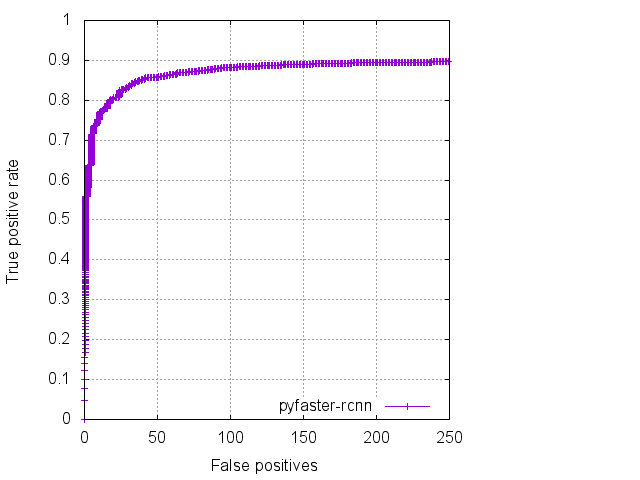
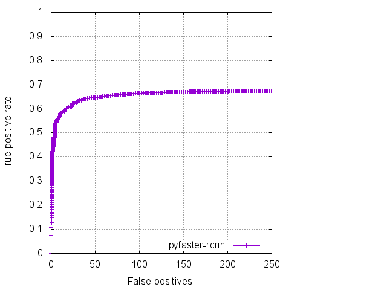

evaluate fddb on Windows
====================================

### Update
添加转换为YOLO所需rect脚本

参见[MRLabeler](https://github.com/imistyrain/MRLabeler)

#### fddb标注可视化

    

#### MTCNN

    

    

#### faster-rcnn

    

    

#### 评估自己的数据

参考evaluationMTCNN.bat